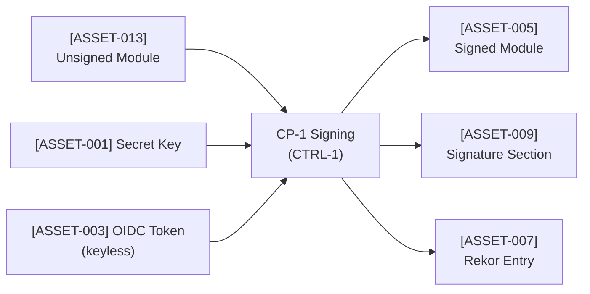
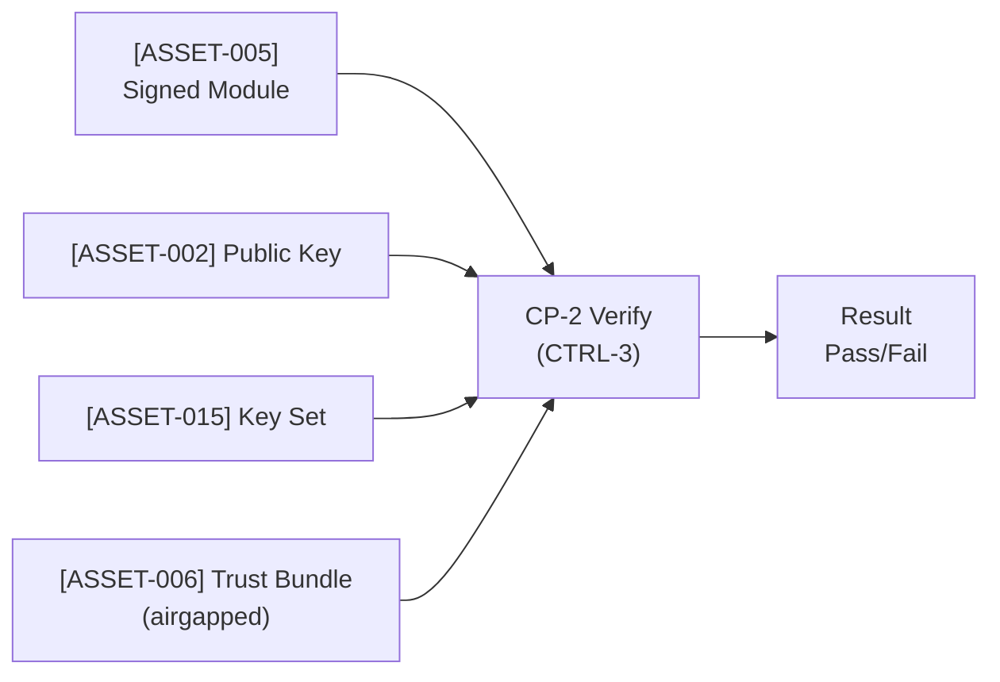

# WSC Asset Inventory

This document catalogs all security-relevant assets managed by WSC with their confidentiality, integrity, and availability (CIA) requirements per ISO/SAE 21434.

## Document Information

| Field | Value |
|-------|-------|
| Version | 2.0 |
| Date | 2026-03-15 |
| Classification | Public |
| Review Cycle | Quarterly |
| Standard Reference | ISO/SAE 21434 Clause 15.3 |

---

## Purpose

This asset inventory supports TARA (Threat Analysis and Risk Assessment) by identifying what WSC protects and what security properties each asset requires. System integrators should reference this when performing TARA on their ITEM (vehicle, ECU, IoT device).

**Note**: This is a *component-level* asset inventory. System integrators must create their own *system-level* asset inventory that includes WSC assets alongside other system assets. At the system level, WSC assets interact with transport channels, device storage, runtime environments, and network infrastructure that are outside WSC's scope but essential to the overall security posture.

---

## Asset Categories

### 1. Cryptographic Keys

Cryptographic keys are the foundational trust anchors in WSC. Their compromise represents the highest-severity failure mode because key material directly controls who can produce valid signatures.

**[[ASSET-001]] Ed25519 Secret Key** is the 64-byte signing key (seed concatenated with public key bytes). Its confidentiality is **Critical** because disclosure enables an attacker to sign arbitrary modules that will pass verification, completely undermining the integrity guarantees WSC provides. Its integrity is equally **Critical**: any modification to the key material invalidates all signatures produced with it and renders the key useless, requiring emergency key rotation across all verifiers. Availability is High because signing operations cannot proceed without it, though offline key generation can serve as a recovery path. The secret key is protected by [[SP-1]] (cryptographic integrity via Ed25519) and [[SP-3]] (key material confidentiality through file permissions and zeroization). It faces threats from [[TS-001]] (private key theft via filesystem access or memory dump) and [[TS-005]] (timing side-channel extraction). Storage is governed by [[SC-4]] (file permissions constraint requiring 0600) and [[CD-2]] (secure file permission model placing keys at `~/.wsc/keys/*.sec`).

**[[ASSET-002]] Ed25519 Public Key** is the 32-byte verification key distributed to all verifiers. It has no confidentiality requirement since it is inherently public, but its integrity is **Critical**: if an attacker can substitute a rogue public key, they can cause verifiers to accept modules signed with the attacker's corresponding secret key. Availability is High because verification cannot proceed without it. The public key is protected by [[SP-1]] and distributed as part of [[ASSET-015]] (Public Key Set) or embedded within [[ASSET-006]] (Trust Bundle). The primary threat is rogue key injection as part of [[TS-004]] (trust bundle manipulation).

**[[ASSET-008]] ECDSA P-256 Ephemeral Key** is a short-lived signing key generated on-demand during Sigstore keyless signing flows. Its confidentiality and integrity are both **Critical** during its brief lifetime, but availability is Low because it is never persisted -- a new one is generated for each signing operation. This key exists only in memory and is zeroized immediately after use, making it inherently resistant to filesystem-based attacks. However, it is still subject to [[TS-005]] (timing side-channel attacks), mitigated by the p256 crate's constant-time operations. The ephemeral nature of this key is a deliberate design choice protected by [[SP-4]] (short-lived credential lifecycle).

**[[ASSET-011]] X.509 Device Private Key** is a certificate-bound device identity key used when WSC operates in X.509 mutual-TLS modes. Its confidentiality and integrity are **Critical** because it represents persistent device identity. Unlike [[ASSET-008]], this key is long-lived and stored on disk, making it subject to the same filesystem threats as [[ASSET-001]]. Availability is High because the device cannot authenticate without it. It is protected by [[SC-4]] and [[CD-2]].

**[[ASSET-012]] X.509 Device Certificate** is the public certificate corresponding to [[ASSET-011]]. Like [[ASSET-002]], it has no confidentiality requirement but demands High integrity (to prevent certificate substitution) and High availability (device authentication depends on it).

---

### 2. Credentials and Tokens

Credentials and tokens are time-bounded authorization artifacts used in WSC's keyless signing flow. Their transient nature is a security feature -- they limit the window of opportunity for attackers.

**[[ASSET-003]] OIDC Identity Token** is a short-lived JWT obtained from an identity provider (such as GitHub Actions or Google) during Sigstore keyless signing. Its confidentiality is High because possession of the token allows signing as the victim's identity until the token expires (approximately 10 minutes). Integrity is High because a modified token will fail validation at Fulcio. Availability is Low because tokens are generated on-demand and never stored. The OIDC token flows through [[DF-1]] (developer-to-signing data flow) into the signing controller [[CTRL-1]]. It faces [[TS-002]] (token theft via CI environment compromise or log exposure), but the risk is assessed as Negligible due to the extremely short lifetime and the fact that all uses are recorded in [[ASSET-007]] (Rekor Entry), providing an immutable audit trail. The token is protected by [[SP-4]] (short-lived credential lifecycle) and zeroized in memory after use.

**[[ASSET-004]] Fulcio Certificate** is an ephemeral X.509 signing certificate issued by the Sigstore Fulcio CA after OIDC authentication. It binds the signer's identity to the ephemeral [[ASSET-008]] key. Confidentiality is N/A because the certificate is intentionally logged in the Rekor transparency log. Integrity is High because tampering would invalidate signatures produced under it. Availability is Low because a new certificate is obtained for each signing operation. This asset flows through [[DF-3]] (Fulcio issuance data flow) and is subject to [[TS-006]] (Fulcio CA compromise), mitigated by [[SP-5]] (certificate pinning) and the inherent 10-minute lifetime. The certificate is a critical link in the chain of trust: it proves that the signer authenticated with a specific identity at a specific time.

**[[ASSET-007]] Rekor Entry** is a transparency log record containing the signing certificate, signature, and artifact hash. It serves as a public, immutable, append-only audit record. Confidentiality is N/A (the entry is public by design). Integrity is High because it must accurately reflect the signing event -- a corrupted entry would undermine the non-repudiation guarantee. Availability is Medium because it is required for keyless verification (verifiers must confirm that the signing certificate was valid at the time of signing). The Rekor entry flows through [[DF-4]] (transparency log data flow). In the STPA control structure, the Rekor log acts as a feedback channel for [[CTRL-3]] (the verification controller), enabling it to confirm certificate validity without trusting the signer.

---

### 3. WebAssembly Artifacts

WebAssembly artifacts are the primary payload that WSC protects. The entire purpose of WSC is to ensure that modules running on target devices are exactly what was built and signed by authorized parties.

**[[ASSET-013]] Unsigned Module** is the original WebAssembly binary before signing. Its confidentiality is Low (source code may be proprietary, but the compiled module is typically distributed). Its integrity is High because the module content becomes the basis for the signature hash -- any pre-signing tampering would be "blessed" by the signature. Availability is Medium. The unsigned module enters WSC through [[DF-1]] and is processed by the signing controlled process [[CP-1]]. While [[TS-003]] (module tampering post-signature) is cryptographically infeasible, tampering *before* signing is a system-level concern that WSC cannot address alone -- this is why the document scope distinguishes component from system responsibilities.

**[[ASSET-005]] Signed Module** is the WebAssembly module with an embedded signature in a custom section. This is the primary output of WSC and represents the integrity guarantee that the entire system depends on. Its confidentiality is Low (same reasoning as the unsigned module). Its integrity is **Critical** -- this is WSC's core security property. If a signed module could be tampered with without detection, the entire system fails. Availability is High because deployment and device operation depend on it. The signed module flows through [[DF-5]] (distribution data flow) to verifiers. It is protected by [[SP-1]] (Ed25519 cryptographic integrity) and [[SP-2]] (SHA-256 content binding). [[TS-003]] confirms that post-signature tampering is cryptographically infeasible.

**[[ASSET-009]] Signature Section** is the custom WebAssembly section embedded within [[ASSET-005]] that contains the signature data, public key reference, and optional metadata. It has no independent confidentiality requirement (it is part of the module). Its integrity is **Critical** because tampering with the signature section causes verification failure, potentially denying service. It is produced by [[CP-1]] (signing process) and consumed by [[CP-2]] (verification process). The section format is protected by [[SP-6]] (structured signature encoding).

**[[ASSET-014]] Detached Signature** is a separate signature file used when the module itself cannot be modified (e.g., read-only storage, third-party modules). It has no confidentiality requirement. Its integrity is **Critical** for the same reasons as [[ASSET-009]]. Its availability is High because verification cannot proceed without it. The detached signature must be distributed alongside the module through a secure channel, making it subject to substitution attacks if the distribution channel is compromised -- a system-level concern addressed by [[SC-6]] (secure transport constraint).

---

### 4. Trust Material

Trust material defines the set of identities and keys that a verifier considers legitimate. Compromise of trust material is among the most severe failure modes because it can cause a verifier to accept malicious modules as authentic.

**[[ASSET-015]] Public Key Set** is the collection of trusted Ed25519 verification keys configured on a verifier. It has no confidentiality requirement (all keys are public). Its integrity is **Critical**: injecting a rogue key into the set means the verifier will accept modules signed by the attacker. Availability is High because verification halts without it. The key set is managed by [[CTRL-5]] (trust material controller) and consumed by [[CP-2]] (verification process). It is protected by [[SP-7]] (trust material integrity verification). The primary threat is [[TS-004]] (trust bundle manipulation), where an attacker compromises the provisioning process to insert unauthorized keys.

**[[ASSET-006]] Trust Bundle** is the self-contained verification package used for air-gapped devices that cannot reach Sigstore or other online services. It contains public keys, certificate pins, and optionally cached Rekor entries. Its integrity is **Critical** because a compromised bundle provides complete bypass of verification on the target device -- the device has no other source of trust. Availability is High because offline devices depend on it exclusively. The trust bundle is provisioned through [[DF-8]] (secure provisioning data flow) under control of [[CTRL-5]]. It faces [[TS-004]] with an attack feasibility rated Very Low (36 points) but Severe impact, resulting in Medium Risk. Controls include bundle signing (the bundle itself is signed), secure provisioning guidance ([[SC-8]]), and certificate pinning for updates. In the STPA control structure, the trust bundle represents the pre-provisioned "ground truth" that the verification controller [[CTRL-3]] relies on -- if this ground truth is corrupted, the controller has no independent way to detect the corruption.

**[[ASSET-010]] Certificate Pins** are SHA-256 hashes of Sigstore certificates (Fulcio root, Rekor signing key) used to detect certificate substitution or CA compromise. They have no confidentiality requirement. Integrity is High because modified pins could cause WSC to accept rogue certificates or reject legitimate ones. Availability is Medium. Certificate pins are a defense-in-depth measure protected by [[SP-5]] (certificate pinning for Sigstore endpoints) and address [[TS-006]] (Fulcio CA compromise).

**[[ASSET-016]] Root CA Certificate** is the Fulcio or custom CA root certificate used to validate signing certificates in keyless flows. Its integrity is **Critical** because a rogue root CA certificate enables arbitrary certificate issuance. Availability is High for keyless verification. This asset is protected by [[SP-5]] and [[CD-5]] (certificate validation design).

---

### 5. Provenance and Metadata

Provenance artifacts provide supply chain transparency and traceability. While they do not directly protect module integrity (that is the role of signatures), they enable auditors and automated systems to verify the origin, build process, and composition of signed modules.

**[[ASSET-017]] In-toto Provenance** is a SLSA-compliant provenance attestation that records how a module was built, including source repository, build command, and builder identity. Its confidentiality is Low (build metadata is typically not sensitive). Its integrity is High because tampered provenance creates false supply chain claims -- an attacker could make a malicious module appear to originate from a trusted build system. Availability is Low because provenance is supplementary to signature verification. Provenance flows through [[DF-9]] (attestation data flow) and is produced by [[CP-3]] (attestation process). It is protected by being signed alongside the module.

**[[ASSET-018]] SBOM (CycloneDX)** is a software bill of materials listing all dependencies and their versions. Its confidentiality is Low. Its integrity is High because a falsified SBOM could hide vulnerable or malicious dependencies. Availability is Low (supplementary). The SBOM supports compliance requirements and vulnerability management workflows.

**[[ASSET-019]] Composition Manifest** is a component dependency graph that tracks how multiple signed modules compose into a larger application. Its confidentiality is Low. Its integrity is High because a tampered manifest could misrepresent the composition, causing incorrect modules to be loaded. Availability is Medium because runtime composition depends on it. The manifest is managed by [[CTRL-6]] (composition controller) and consumed by [[CP-4]] (composition verification process).

---

### 6. Operational Data

Operational data supports monitoring, configuration, and administration of WSC. While not directly involved in cryptographic operations, the integrity of operational data is essential for incident response, forensics, and correct system behavior.

**[[ASSET-020]] Audit Logs** are structured signing and verification event logs. Their confidentiality is Medium because they may contain identity information (signer email addresses, OIDC subject claims). Their integrity is High because the audit trail must be tamper-evident -- if an attacker can erase or modify log entries, they can cover their tracks after signing malicious modules. Availability is Medium. Audit logs are produced by all WSC controlled processes ([[CP-1]] through [[CP-4]]) and flow through [[DF-10]] (audit data flow) to the monitoring controller [[CTRL-7]]. They are protected by [[SP-8]] (audit trail integrity) and [[CD-9]] (structured logging design). In the STPA control structure, audit logs serve as the primary feedback mechanism for detecting unsafe control actions.

**[[ASSET-021]] Key ID Mappings** are logical name-to-key associations that allow operators to refer to keys by human-readable names rather than raw public key bytes. Their confidentiality is Low. Their integrity is Medium because corrupted mappings could cause the wrong key to be used for signing or verification, though this would typically be caught by signature verification failure. Availability is Medium. Key ID mappings are managed by [[CTRL-5]] (trust material controller).

**[[ASSET-022]] Configuration Files** are WSC runtime settings controlling behavior such as default key paths, Sigstore endpoints, certificate pin values, and logging levels. Their confidentiality is Low (configuration is not sensitive). Their integrity is Medium because malicious configuration changes could redirect WSC to attacker-controlled endpoints or disable security features. Availability is Medium. Configuration is consumed by all controllers at initialization. Storage follows [[SC-4]] and [[CD-2]], with configuration files placed at `~/.wsc/` with appropriate permissions.

---

## Asset Flows

The movement of assets through WSC follows two primary data flows, each governed by the STPA control structure.

### Signing Flow

In the signing flow, an unsigned module ([[ASSET-013]]) enters through [[DF-1]] and is processed by the signing controlled process [[CP-1]], which is directed by the signing controller [[CTRL-1]]. The controller receives the signing command from the developer or CI system and selects the appropriate signing mode (key-based or keyless).

For key-based signing, [[CP-1]] reads [[ASSET-001]] (secret key) from secure storage governed by [[SC-4]]. For keyless signing, [[CP-1]] obtains [[ASSET-003]] (OIDC token) via [[DF-2]], exchanges it for [[ASSET-004]] (Fulcio certificate) via [[DF-3]], and generates [[ASSET-008]] (ephemeral ECDSA key) in memory.

The signing process produces [[ASSET-005]] (signed module) containing [[ASSET-009]] (signature section). In keyless mode, it also produces [[ASSET-007]] (Rekor entry) via [[DF-4]], providing transparency and non-repudiation.

### Verification Flow

In the verification flow, a signed module ([[ASSET-005]]) enters through [[DF-5]] and is processed by the verification controlled process [[CP-2]], directed by the verification controller [[CTRL-3]]. The controller determines the verification mode based on available trust material.

For online verification, [[CP-2]] uses [[ASSET-002]] (public key) or [[ASSET-015]] (public key set) and may consult [[ASSET-007]] (Rekor entry) via [[DF-6]] to confirm certificate validity. For air-gapped verification, [[CP-2]] relies exclusively on [[ASSET-006]] (trust bundle), which was pre-provisioned through [[DF-8]] under control of [[CTRL-5]].

The verification result (pass or fail) is reported back to [[CTRL-3]], which enforces the security policy: only verified modules proceed to execution. This is the critical safety constraint -- [[SC-1]] requires that no unverified module is ever loaded.

---

## Storage Locations and Permissions

Asset storage is governed by [[SC-4]] (file permissions constraint) and implemented through [[CD-2]] (secure file permission model). The storage model separates secret material from public material and ensures that in-memory secrets are never persisted to disk.

**Secret keys** ([[ASSET-001]], [[ASSET-011]]) are stored at `~/.wsc/keys/*.sec` with permissions 0600 (owner read/write only). This prevents other users on the same system from reading key material. [[CD-2]] enforces these permissions at key generation time and verifies them before key use -- if permissions have been relaxed, WSC refuses to load the key.

**Public keys** ([[ASSET-002]], [[ASSET-012]], [[ASSET-015]]) are stored at `~/.wsc/keys/*.pub` with permissions 0644 (world readable). Public keys have no confidentiality requirement, and broader read access simplifies key distribution.

**Trust bundles** ([[ASSET-006]]) are stored at `~/.wsc/trust/*.json` with permissions 0644. While the bundle content is not confidential, its integrity is critical. Bundle integrity is verified cryptographically (the bundle is signed) rather than relying solely on file permissions.

**OIDC tokens** ([[ASSET-003]]) and **ephemeral keys** ([[ASSET-008]]) exist in memory only and are never written to disk. They are zeroized immediately after use, ensuring that a post-facto memory dump or core dump cannot recover them. This is enforced by [[SP-3]] (key material confidentiality).

**Configuration and operational data** ([[ASSET-020]], [[ASSET-021]], [[ASSET-022]]) are stored under `~/.wsc/` with permissions appropriate to their sensitivity. Audit logs may contain identity information and should be protected accordingly by the system integrator.

---

## Asset Dependencies

Asset dependencies in WSC follow the STPA control structure, where controllers issue commands to controlled processes, and feedback flows back to confirm correct operation.

**Signing dependency chain**: The signing controller [[CTRL-1]] directs [[CP-1]] to produce [[ASSET-005]] (signed module). For key-based signing, [[CP-1]] depends on [[ASSET-001]] (secret key) -- without it, signing cannot proceed. For keyless signing, [[CP-1]] depends on the chain [[ASSET-003]] (OIDC token) leading to [[ASSET-004]] (Fulcio certificate) leading to [[ASSET-008]] (ephemeral key) and [[ASSET-007]] (Rekor entry). If any link in this chain fails, keyless signing is unavailable. The system should fall back to key-based signing, a degraded but functional mode. This fallback behavior is a safety constraint ([[SC-3]]) that prevents complete loss of signing capability.

**Verification dependency chain**: The verification controller [[CTRL-3]] directs [[CP-2]] to verify [[ASSET-005]]. Online verification depends on [[ASSET-002]] (public key) plus [[ASSET-015]] (public key set) configured on the verifier. Air-gapped verification depends exclusively on [[ASSET-006]] (trust bundle), which encapsulates all necessary trust material. If [[ASSET-006]] is unavailable or corrupted on an air-gapped device, verification is impossible and the device cannot load new modules -- a safety-preserving failure mode ([[SC-2]], fail-closed behavior).

**Trust provisioning dependency**: [[CTRL-5]] (trust material controller) manages the provisioning of [[ASSET-006]] and [[ASSET-015]] to verifiers. This is a one-time or infrequent operation that must occur over a secure channel ([[DF-8]]). The integrity of this provisioning process is paramount because it establishes the root of trust for all subsequent verifications. If provisioning is compromised ([[TS-004]]), all downstream verification is undermined.

**Audit dependency**: [[CTRL-7]] (monitoring controller) depends on [[ASSET-020]] (audit logs) produced by all controlled processes. Without intact audit logs, the system loses the ability to detect and investigate security incidents. This is a feedback dependency in the STPA sense: the controller cannot detect unsafe control actions if the feedback channel is corrupted.

---

## Threat Mapping

Each asset is subject to specific threats documented in the risk assessment. The mapping below connects assets to their threat scenarios, showing which security properties and cybersecurity designs provide protection.

**[[ASSET-001]] (Ed25519 Secret Key)** faces [[TS-001]] (private key theft through filesystem access, memory dump, or insider threat) and [[TS-005]] (timing side-channel extraction). Mitigations include 0600 file permissions ([[SC-4]], [[CD-2]]), zeroization on drop ([[SP-3]]), constant-time operations ([[CD-4]]), and planned HSM support ([[CD-7]]). The risk assessment rates [[TS-001]] as Medium Risk (Low AF, Major impact) and [[TS-005]] as Low Risk (Very Low AF, Major impact).

**[[ASSET-003]] (OIDC Token)** faces [[TS-002]] (token theft via CI environment compromise or log exposure). Despite the High confidentiality requirement, the risk is Negligible (Very Low AF, Moderate impact) because the token lifetime is approximately 10 minutes, all uses are logged in [[ASSET-007]], and the identity is cryptographically bound to the signature by [[ASSET-004]].

**[[ASSET-005]] (Signed Module)** faces [[TS-003]] (post-signature tampering through transit interception or storage modification). This threat is cryptographically infeasible due to [[SP-1]] (Ed25519 signature) and [[SP-2]] (SHA-256 content hash). The risk assessment rates this as No Risk -- the signature is the security control, not the risk.

**[[ASSET-004]] (Fulcio Certificate)** faces [[TS-006]] (Fulcio CA compromise enabling rogue certificate issuance). This is rated Very Low AF (57 points, requiring nation-state resources) with Severe impact, resulting in Medium Risk. Controls include certificate pinning ([[SP-5]], [[CD-5]]), short-lived certificates ([[SP-4]]), Rekor transparency ([[ASSET-007]]), and fallback to key-based signing ([[SC-3]]).

**[[ASSET-006]] (Trust Bundle)** faces [[TS-004]] (bundle manipulation through provisioning compromise or file substitution). This is rated Very Low AF (36 points) with Severe impact, resulting in Medium Risk. Controls include bundle signing, secure provisioning guidance ([[SC-8]]), and certificate pinning for updates ([[SP-5]]). This is the highest-impact threat in the air-gapped deployment model because a compromised bundle grants complete verification bypass with no online recourse.

**[[ASSET-015]] (Public Key Set)** faces a subset of [[TS-004]] (rogue key injection). Integrity verification ([[SP-7]]) and pinning protect against unauthorized modifications. System integrators must ensure that key set updates follow their change management process.

**[[ASSET-020]] (Audit Logs)** face [[TS-018]] (log tampering to conceal malicious activity). Audit trail integrity ([[SP-8]]) and structured logging ([[CD-9]]) provide detection capability, but system integrators are responsible for protecting log storage and forwarding logs to a tamper-evident central system.

---

## Revision History

| Version | Date | Author | Changes |
|---------|------|--------|---------|
| 1.0 | 2026-01-06 | WSC Team | Initial asset inventory per ISO 21434 |
| 2.0 | 2026-03-15 | WSC Team | Converted to Rivet format with cross-references to ASSET, TS, DF, SP, CTRL, CP, SC, and CD artifacts |
