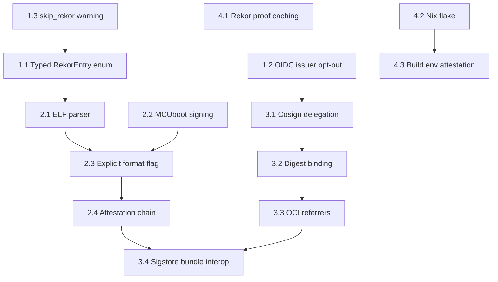

# STPA-Sec Implementation Plan

Based on two rounds of STPA-Sec analysis producing 289 artifacts across 22
types. This plan prioritizes findings by severity and feasibility.

## Phase 1: Immediate security hardening (current codebase)

**Priority: Critical — addresses findings in shipped code.**

### 1.1 Replace magic string sentinel with typed enum

- **Artifacts:** AS-6 residual, DD-2
- **What:** Replace `uuid == "skipped"` string comparison with
  `enum RekorEntryStatus { Verified(RekorEntry), Skipped }` in
  `KeylessSignature` and `KeylessSigner`
- **Files:** `src/lib/src/signature/keyless/signer.rs`,
  `src/lib/src/signature/keyless/format.rs`
- **Effort:** Small
- **Risk:** Low — type system prevents sentinel bypass

### 1.2 Make OIDC issuer validation opt-out

- **Artifacts:** UCA-12, AS-13
- **What:** Change default to require `expected_issuer` or explicit
  `--allow-any-issuer` flag. Log warning when no issuer validation is
  configured. Add URL normalization for trailing slash.
- **Files:** `src/lib/src/signature/keyless/signer.rs`, `src/cli/main.rs`
- **Effort:** Small
- **Risk:** Medium — breaking change for existing CI pipelines that don't
  set `--expected-issuer`. Mitigate with deprecation warning first.

### 1.3 Emit loud warning for skip_rekor

- **Artifacts:** DD-2, skip_rekor interaction
- **What:** When `skip_rekor=true`, emit a structured warning via
  `log::error!` and stderr banner stating the produced module cannot pass
  keyless verification. Update doc comments. Consider making
  `skip_rekor` `#[cfg(test)]` only.
- **Files:** `src/lib/src/signature/keyless/signer.rs`
- **Effort:** Small
- **Risk:** Low

### 1.4 Implement OCI dual-layer verification stub

- **Artifacts:** Gap found in PulseEngine org research
- **What:** Implement `wasm_component_verify_signatures()` in
  `rules_wasm_component/wkg/private/oci_signing.bzl` (currently a TODO)
- **Repo:** `pulseengine/rules_wasm_component`
- **Effort:** Medium
- **Risk:** Low

## Phase 2: ELF binary signing (FEAT-2 / Issue #47)

**Priority: High — extends sigil to safety-critical firmware.**

### 2.1 ELF format parser with security constraints

- **Artifacts:** H-13, SC-12, UCA-13, UCA-17, AS-14
- **What:** Implement ELF parser that validates section header consistency,
  checks for overlapping sections, enforces resource bounds. Hash full
  file content (not section-by-section) to prevent section/program header
  divergence attacks.
- **Files:** New `src/lib/src/elf/` module
- **Effort:** Large
- **Risk:** High — ELF format complexity. Mitigate with extensive fuzz
  testing (at least 3 new fuzz targets).

### 2.2 MCUboot TLV signing with size verification

- **Artifacts:** H-14, SC-13, UCA-14, AS-15
- **What:** Implement MCUboot image signing with independent image size
  computation. Reject images where header `ih_img_size` disagrees with
  file length. Support Ed25519 (matching MCUboot's key types).
- **Files:** New `src/lib/src/mcuboot/` module
- **Effort:** Medium
- **Risk:** Medium — MCUboot format is simpler than ELF but mistakes
  are safety-critical.

### 2.3 Explicit format specification (no auto-detect)

- **Artifacts:** H-16, SC-15, UCA-16, AS-17
- **What:** Add mandatory `--format wasm|elf|mcuboot` CLI flag for sign
  and verify. Magic byte validation as secondary check only. Reject
  format/content mismatches.
- **Files:** `src/cli/main.rs`, new `src/lib/src/format_detect.rs`
- **Effort:** Small
- **Risk:** Low — breaking CLI change, mitigate with clear error messages.

### 2.4 Attestation chain continuity across WASM-to-native boundary

- **Artifacts:** L-7, H-15, SC-14, UCA-15, AS-16, DF-13
- **What:** Design attestation chain: `WASM signature → transcoding
  attestation (signed by synth, referencing input WASM hash + output
  native hash) → native signature`. The native signature embeds or
  references the transcoding attestation.
- **Repo:** Coordination with `pulseengine/synth`
- **Effort:** Large
- **Risk:** High — cross-repo design requiring synth integration.

## Phase 3: Container signing integration

**Priority: Medium — extends PulseEngine pipeline to OCI ecosystem.**

### 3.1 Cosign delegation with integrity verification

- **Artifacts:** H-19, SC-18, UCA-20, AS-20
- **What:** Implement cosign subprocess delegation with binary integrity
  verification (checksum/signature of cosign binary before invocation).
  Pin cosign version. Use `sigstore-rs` for native verification where
  possible.
- **Files:** New `src/lib/src/container/` module
- **Effort:** Medium
- **Risk:** Medium — external dependency management.

### 3.2 Tag-to-digest resolution and digest binding

- **Artifacts:** H-17, SC-16, SC-19, UCA-18, UCA-21, AS-18, AS-21
- **What:** Always resolve image tags to digests before signing. Embed
  digest in signature. On verification, validate signature's digest claim
  matches actual image digest. Reject tag-only references.
- **Files:** `src/lib/src/container/`
- **Effort:** Medium
- **Risk:** Low — well-understood pattern from cosign.

### 3.3 OCI 1.1 referrers API for signature storage

- **Artifacts:** H-18, SC-17, UCA-19, AS-19
- **What:** Store signatures using OCI 1.1 referrers API (not tag-based)
  to reduce GC risk. Fall back to tag-based for registries that don't
  support referrers.
- **Files:** `src/lib/src/container/`
- **Effort:** Medium
- **Risk:** Medium — registry compatibility variance.

### 3.4 Sigstore bundle interoperability

- **What:** Adopt Sigstore bundle format (`protobuf-specs`) for sigil's
  blob signing output to achieve full cosign interoperability. Sigil's
  attestations would be verifiable by `cosign verify-blob`.
- **Files:** New `src/lib/src/bundle/` module
- **Effort:** Medium
- **Risk:** Low — format is well-specified.

## Phase 4: Infrastructure and resilience

**Priority: Medium — addresses availability and operational risks.**

### 4.1 Rekor inclusion proof caching

- **Artifacts:** H-12
- **What:** Cache verified Rekor inclusion proofs locally so that
  verification can succeed during transient Rekor outages. Cache keyed
  by module hash + Rekor entry UUID. TTL-based expiry.
- **Files:** `src/lib/src/signature/keyless/rekor.rs`, new cache module
- **Effort:** Medium
- **Risk:** Medium — cache invalidation complexity.

### 4.2 Nix flake for reproducible builds (Issue #48)

- **Artifacts:** FEAT-3, REQ-6
- **What:** Add `flake.nix` with pinned toolchain for SLSA L3.
- **Effort:** Medium

### 4.3 Build environment attestation (Issue #49)

- **Artifacts:** FEAT-4, REQ-10
- **What:** Capture Bazel version, Nix hash, rustc version in SLSA
  provenance attestation.
- **Effort:** Small

## Dependency graph

## Artifact summary

| Phase | New Artifacts | Key Findings |
|-------|--------------|--------------|
| 1 | AS-13 (env var injection) | Residual risks from our own fixes |
| 2 | L-6, L-7, H-13–H-16, UCA-13–UCA-17, AS-14–AS-17, SC-12–SC-15 | 4 critical attack scenarios for binary signing |
| 3 | L-8, L-9, H-17–H-20, UCA-18–UCA-21, AS-18–AS-21, SC-16–SC-19 | Cross-image signature reuse is critical |
| 4 | H-12 | Availability vs security tradeoff from DD-2 |
